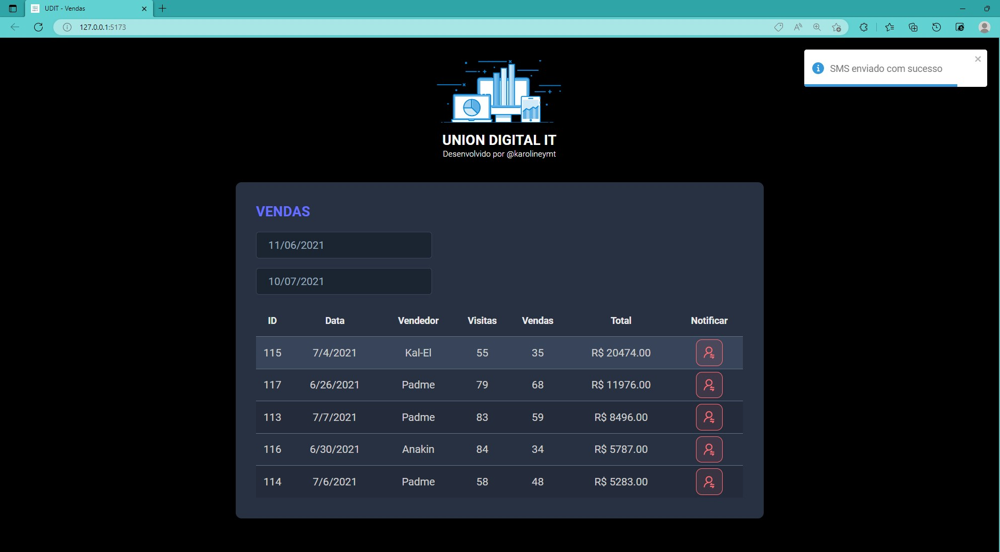

<h1 align="center"> Dev Superior - Spring React </h1>

> *Create a complete app for your portfolio with the most demanded technologies in the market*

  <a href="#-technologies">Technologies</a>&nbsp;&nbsp;&nbsp;|&nbsp;&nbsp;&nbsp;
  <a href="#-project">Project</a>&nbsp;&nbsp;&nbsp;|&nbsp;&nbsp;&nbsp;
  <a href="#-references">References</a>&nbsp;&nbsp;&nbsp;|&nbsp;&nbsp;&nbsp;
  <a href="#memo-licence">Licence</a>

  

 

## Pages

### Class 1

    

### Class 2

    

### Class 3

    

    

### Class 4

    

### Class 5

    

    

## 🚀 Technologies

This project was developed with the following technologies:

- [Next.js](https://nextjs.org/docs/getting-started)
- [Supabase](https://supabase.com/)

## 💻 Project

Welcome! It's time to develop a brand new project during React Immersion!

START
- npm install
- npm run dev

CLASS 1
- Initial project with NextJS;
- NPM scripts;
- Version of Node and that NPM comes with the project;
- `npx gitignore node` to generate the project's gitignore;
- Creation of a component with React;
- Styles in React;
- StyledComponents;
- Use Props in React;
- Children from React;

CLASS 2
- Creation *search.js*;
- Use of State;
- Prop-drilling concept;
- In the end, we create the banner using Styled Components and passing Props through it.

CLASS 3
- Design Systems;
- Importance of having color contracts and Design values;
- Creation of the Dark Mode Switch component;
- Local state creation in our Dark Mode Switch component;
- Use of state not to do Prop Drilling but to have a context that allows us to access data in a "global" way;
- Provider that configures which data will be available in the context.

CLASS 4
- Import of styles;
- Use of form;
- USe Forms and State can be complex;
- Custom Hooks creation.

CLASS 5
- Use of Fetch API;
- View the GitHub API;
- Understand HTTP statuses;
- How to use the browser's network tab;
- How to get started in Supabase;
- Creating our first table;
- Important: do not activate Supabase row protection;
- We use Supabase public client;
- We created a service at the end to better organize our code.

Links Usefull:

 Node Download - https://nodejs.org/en/download/

 VSCode Download -  https://code.visualstudio.com/download

## 🔖 References

https://www.alura.com.br/

## :memo: Licence

This project is under the MIT license.

---

 Made with ♥ by Karoline :wave: [Let's program together!](https://www.linkedin.com/in/karoline-hikari-yamamoto/)

